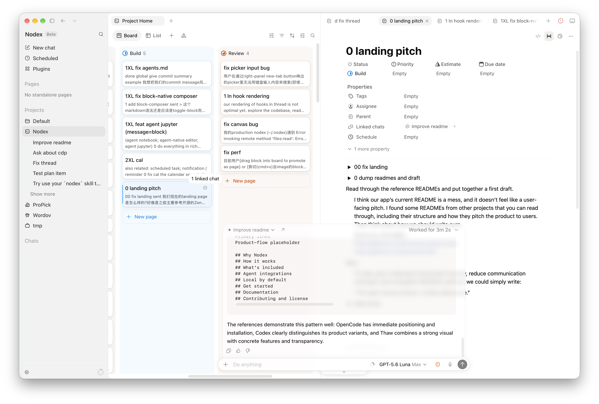

<p align="center">
  <a href="https://nodex.jyu.app">
    <picture>
      <source srcset=".github/assets/nodex-wordmark-dark.svg" media="(prefers-color-scheme: dark)">
      <source srcset=".github/assets/nodex-wordmark-light.svg" media="(prefers-color-scheme: light)">
      
    </picture>
  </a>
</p>

<p align="center">The open-source Notion+Codex alternative.</p>

<p align="center">
  <a href="https://nodex.jyu.app">Website</a> ·
  <a href="https://github.com/junyudev/nodex/releases/latest">Download</a> ·
  <a href="https://nodex.jyu.app/changelog/">Changelog</a>
</p>

<!-- <p align="center">
  <a href="https://github.com/junyudev/nodex/releases/latest"></a>
  
  <a href="LICENSE"></a>
</p> -->

<picture>
  <source srcset=".github/assets/splash-dark.png" media="(prefers-color-scheme: dark)">
  <source srcset=".github/assets/splash-light.png" media="(prefers-color-scheme: light)">
  
</picture>

<!--
README TODO:
- Replace the splash with one polished GIF showing the full Page → Agent → Review → Page loop.
  Keep it readable at GitHub README width and avoid a generic marketing collage.
- Write a complete README.zh.md, then add a centered `English | 简体中文` language switcher.
- Add a Discord badge after Nodex has an official public server and real invite.
- Add build or release badges only after choosing a meaningful user-facing status signal.
- Revisit the README and landing-page taglines together so the positioning does not drift.
- Publish the agent setup section after Homebrew installation also installs the Nodex CLI.
-->

## Installation

```bash
brew install --cask junyudev/tap/nodex
```

Or grab the `.dmg` ([nodex-arm64.dmg](https://github.com/junyudev/nodex/releases/latest/download/Nodex-latest-arm64.dmg)) from the [latest release](https://github.com/junyudev/nodex/releases/latest) and drag Nodex to Applications.

(Nodex is currently in beta for macOS 15 and later.)

## Why Nodex

Coding agents are good at doing the work. The messy part is everything around it: turning notes
into prompts, remembering which chat belongs to which task, finding the right branch, reviewing
the result, and updating the plan afterward.

Nodex keeps the work itself (not just the conversation) at the center. Your notes, agent chats,
project files, terminals, browser previews, diffs, and history stay together, so the next step
starts with the context the last one produced.

## The Nodex workflow

- **Shape the work.** Turn ideas, bugs, specs, and research into rich Pages, then organize them
  with Database Views.
- **Run agents in context.** Start or resume agent chats in the right Project, local checkout, or
  isolated worktree.
- **Review the result.** Inspect files, terminal output, browser previews, and Git changes beside
  the conversation that produced them.
- **Keep the source of truth current.** Agents can read and update authorized Nodex Pages through
  the native CLI and Agent Skill, so useful context does not end as chat output.

## Local-first by design

Your Nodex workspace lives on your machine. Projects point to folders you already own, while Pages,
Databases, Canvases, document history, assets, backups, and window state remain under one local
Profile. Nodex does not require a cloud workspace to organize your work.

<!-- ### Connect your coding agent

Nodex includes a native CLI and an official Agent Skill for working with Pages, rich Nested
Markdown, Databases, and saved Views through the same local data authority as the desktop app.

After moving `Nodex.app` into `/Applications`, use **Nodex → Install Command Line Tool…** and

**Set Up Agent Skills…**. You can also run:

```bash
nodex setup
```

The Skill supports local, shell-capable agents such as Codex and Claude Code. See the
[CLI reference](docs/CLI.md) for commands and capability details. -->

## Documentation

- [Product specification](docs/product-specs/nodex-product-spec.md)
- [Architecture](docs/ARCHITECTURE.md)
- [Development guide](docs/development.md)

## License

Nodex is open source under the [Apache License 2.0](LICENSE).
