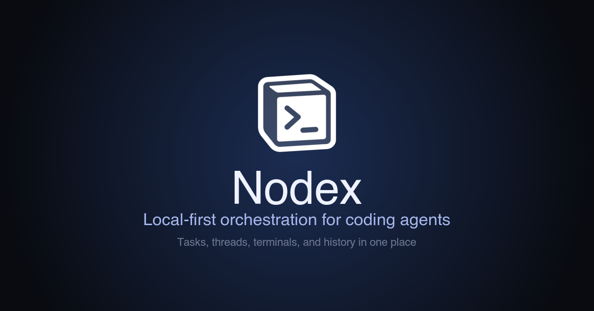

# Nodex



**A local-first workspace for shared context and agent work.**

Nodex keeps you and your coding agents on the same Page. Shape a task in
blocks, send the context that matters to a new or existing chat, and keep the
brief beside the code, terminal, browser, files, and Review.

[Download for macOS](https://github.com/junyudev/nodex/releases/latest/download/Nodex-latest-arm64.dmg) · [Intel Mac download](https://github.com/junyudev/nodex/releases/latest/download/Nodex-latest-x64.dmg) · [Product page](https://nodex.jyu.app) · [Changelog](https://nodex.jyu.app/changelog/)

## Why Nodex

A useful task rarely fits in one prompt. It has goals, constraints, references,
decisions, and a definition of done. When that context lives apart from the
agent doing the work, developers spend time reconstructing it across chats,
notes, terminals, and review tools.

A Nodex Page is durable working context. It stays visible while the work moves
through a Project, and Nodex’s native CLI and official Skill let local agents search, read, create,
and update Pages directly.

## What You Can Do

- **Shape work in Pages.** Write structured briefs with blocks, attachments,
  images, toggles, and task properties.
- **Send the right context to an agent.** Select Page content and start a new
  chat or add it to an existing one without rebuilding the prompt elsewhere.
- **Keep execution beside the brief.** Use agent chat, files, terminals,
  browser tabs, and Project tools without losing the Page that framed the work.
- **Review changes in context.** Inspect files and diffs beside the conversation
  that produced them.
- **Let agents work from shared Pages.** The native CLI and official Skill let
  local coding agents search, read, create, and update Pages.
- **Resume the whole workspace.** Reopen windows, sessions, panels, and local
  Project state without reconstructing the setup.

## Who It Is For

Nodex is for developers who use coding agents in real local projects:

- developers turning product and implementation context into agent work
- builders running several tasks without losing the brief behind each one
- reviewers who want the Page, conversation, files, and diff in reach together
- teams that value open-source software and local ownership

## Local-First by Design

Your Library and Project state live on your machine in Nodex’s SQLite-backed
core. Project source folders remain folders you own, and the desktop app and
CLI are open source.

## Try Nodex

Nodex is in beta for macOS 15 and later, with builds for Apple silicon and Intel Macs.

Start with the [public product page](https://nodex.jyu.app), or download the latest build directly:

- [Apple silicon Mac](https://github.com/junyudev/nodex/releases/latest/download/Nodex-latest-arm64.dmg)
- [Intel Mac](https://github.com/junyudev/nodex/releases/latest/download/Nodex-latest-x64.dmg)

## Use Nodex from Codex or Claude Code

Nodex ships a native CLI and one official `nodex` Agent Skill for working with
Pages, rich Nested Markdown, saved database Views, and Board placement through
the same local Core authority as the desktop app.

After moving `Nodex.app` into `/Applications`, install the CLI from
**Nodex → Install Command Line Tool…**, then choose **Set Up Agent Skills…**.
The equivalent terminal command is:

```bash
nodex setup
```

Native setup is deliberately global-only and link-based:

- Codex: `~/.agents/skills/nodex`
- Claude Code: `${CLAUDE_CONFIG_DIR:-~/.claude}/skills/nodex`

It never writes project files, creates `.agents/.nodex`, copies the Skill, or
overwrites an existing file, directory, or foreign link. `nodex skills status`
distinguishes a current managed link, a compatible external install, a missing
target, and a conflict; rerunning setup safely completes an interrupted install.

For a third-party global or project-local copy, use the public official mirror:

```bash
npx skills@latest add NodexApp/skills
```

For a reproducible release, use the mirror's annotated version tag:
`npx skills@latest add https://github.com/NodexApp/skills/tree/vX.Y.Z`.

That copy remains externally owned—Nodex reports compatible content but never
adopts, updates, or removes it. The Skill requires a compatible local `nodex`
CLI and a shell-capable local Agent. It does not make local Nodex data available
to Claude.ai, remote Cowork/cloud sessions, or any machine where Nodex is not
running. `nodex capabilities --json` reports the installed Agent interface and
bundle revision; a newer Skill/CLI mismatch must be resolved by updating Nodex,
not by bypassing its typed commands or reading SQLite directly.

## Project Notes

Contributor setup, build, release, and deployment details are kept outside this pitch page:

- [Developer guide](docs/development.md)
- [macOS release notes](docs/release-macos.md)
- [Landing site operations](docs/landing-site.md)
