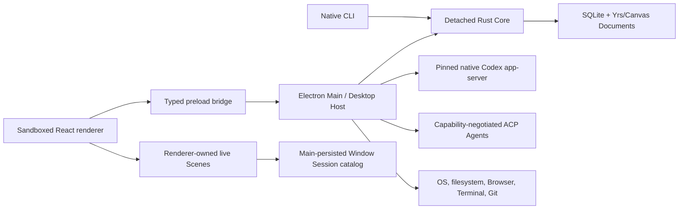
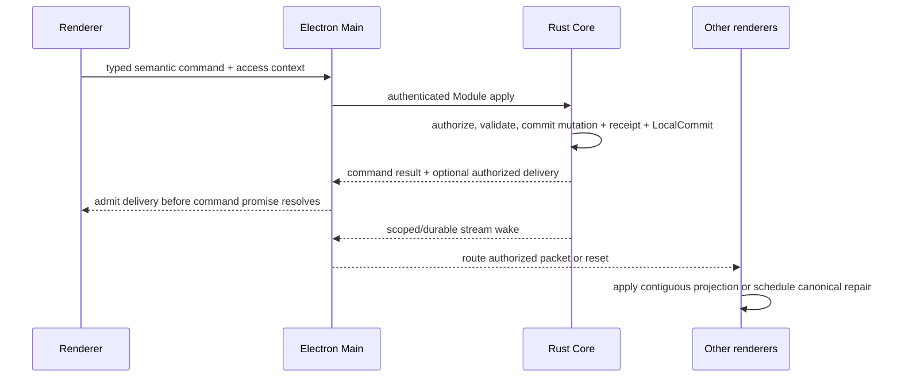
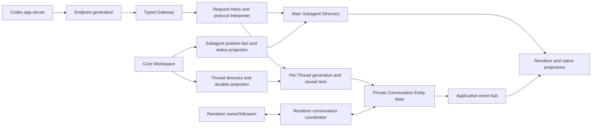

# Architecture

This document is the compact map of Nodex's system boundaries, state owners, dependency directions, and system-wide invariants. It answers four questions:

1. Which Module owns a piece of state or behavior?
2. Which boundary may mutate it?
3. How may the major runtimes depend on one another?
4. Where is the detailed contract documented?

It is deliberately not a file inventory, migration ledger, product specification, or reliability runbook. See [Documentation ownership](#documentation-ownership) before adding detail.

## System at a glance

Nodex is a local-first, block-based agent orchestrator. One detached native Rust Core is the exclusive SQLite and collaborative-document authority for a Profile. Electron is the Desktop Host: it supervises Core, owns windows and operating system integration, hosts the pinned native Codex app-server and capability-negotiated external runtimes, and exposes typed capabilities to sandboxed renderers. The native CLI reaches the same Core contracts without going through Electron.



The principal dependency rule is inward ownership:

```text
Renderer -> Preload -> Electron Main adapters -> Core protocol -> Core Modules
Native CLI -------------------------------> Core protocol -> Core Modules

Core Modules -> domain/infrastructure
Core server  -> protocol + Core Modules

Never:
Renderer -> SQLite / Node / Core internals
Electron Main -> nodex.db / Yrs transaction reconstruction
Core Modules -> Electron / renderer / transport presentation
```

## Domain and authority model

The canonical vocabulary and full domain invariants live in [CONTEXT.md](CONTEXT.md). This section records only the ownership relationships needed to navigate the system.

### Content and execution are separate

```text
Profile
└── Library                         durable content scope
    ├── Block                       persistent content identity
    ├── Page                        document-bearing Block
    │   └── Document                synchronized title/body authority
    ├── Canvas                      document-bearing Block
    │   └── Document                scene authority
    └── Database                    placeable Container Block
        ├── Page-key namespace      readable alias registry + counter
        ├── Data Source             schema + Page rows + typed Property values
        └── View                    presentation over one Data Source

Project                              execution context
├── primary Database binding
├── explicit Library resource grants
├── filesystem sources
└── Sessions / Threads / terminals / approval policy
```

One Profile owns one Library. Library owns durable content; Project owns execution context and access to content. Archiving or deleting a Project never owns, moves, or deletes Library content.

Blocks, Documents, owner registries, search/asset projections, and top-level placement are physically Library-scoped. A Project coordinate retained by a receipt, change log, automation record, recovery artifact, or delivery packet names actor/execution/delivery provenance, not content ownership. `library_block_placements` is the sole root-order authority; runtime mutations do not dual-write a Project-local placement graph.

Every active Page has exactly one `library | page | data_source` parent. Page ownership forms an acyclic forest. References, mentions, backlinks, relations, and Views are non-owning and do not expand authorization. Page ID is Block ID; Document identity remains independent.

Each Page also directly owns an independent Files manifest. A File's stable
identity and logical path belong to the Library Module; exact bytes are
immutable Core-managed blobs shared by content hash. Body attachments and
images are non-owning placements that may preserve the same File identity
across Page Documents in one Library. A containing Page can resolve only the
current presentation metadata and bytes of its canonical placements; owner
manifest, version history, mutation, and lifecycle authority do not travel with
the placement. A typed identity-preserving Block move may rehome a File only
when its current owner is the source host and its complete post-state placement
set is exclusively in one target host. The Library Module derives and commits
that consequence together with both Documents, immutable File history,
manifests, receipt, and LocalCommit; callers cannot request it independently.
File mutations publish exact affected File identities, while Document commits
publish exact added and removed Page File reference identities; neither signal
couples foreign Pages to the owner manifest revision. Renderer File reads share
one authorization-sensitive cache keyed by Store epoch, access context,
containing Page, and File identity, so invalidation remains exact and cached
bytes never cross an authority change. Child Page Files compose through the
existing Page ownership forest instead of flattening into their parent. Core is
the only publication, authorization, metadata-mutation, copy/transfer, backup,
restore, and garbage-collection authority. Electron and CLI may stream or save
explicit user-selected bytes. Electron may resolve one authorized current File version
to its physical blob locator only for the opt-in local-path clipboard
presentation; the locator is never stored as File identity or returned through
the general renderer/Agent File interfaces. See
[Page Files Behavior](product-specs/page-files-behavior.md),
[ADR 0051](adr/0051-page-owned-files-and-immutable-bytes.md), and
[ADR 0052](adr/0052-file-placement-is-independent-of-ownership.md).

A top-level Canvas is authorized by an explicit generic Canvas resource grant. An embedded Canvas inherits the host Page authorization path and has no active direct Canvas grant. Moving between Library and Page placement changes that grant state atomically with the host shell and never rehomes content.

A Database is a Container Block that owns Data Sources and Views. An enabled Database also owns one Page-key namespace whose Library-unique prefix history, monotonic counter, and immutable Database/Page assignments provide readable aliases without replacing Page UUID identity. A Data Source owns its schema, row Pages, typed Property values, Page Property layout, and query identity. Its fixed `task_parent` Property is a cardinality-one self-Relation; the Relation value header is the sole concurrency authority for roots and children, and only its edge may carry sibling rank. The resulting task hierarchy is non-owning presentation semantics: it never changes a Page's structural `library | page | data_source` parent or expands authorization, and there is no parallel hierarchy graph. A View targets exactly one Data Source and owns one durable Board or List layout, ordered query rules, presentation, conditional colors, complete Property order and visibility, and one View-global Page rank. Every visible View tab selects one View identity; an explicit layout conversion preserves that identity while replacing layout-specific settings. Per-View Profile state has two independent authorities: one revision-fenced preference envelope with separately sparse rules and presentation overrides that cannot change layout or identity, and a bounded set of typed collapsed occurrences changed by idempotent per-target patches. Their delivery atoms require View read authorization but carry no shared projection coordinates, so personal changes converge without invalidating View content or Library navigation. The Rust Database Module contract owns the complete typed View-definition grammar and a tagged read command for each legal coordinate set; identity descriptors are typed responses, so unrelated target, window, group, and Page-ID parameters cannot cross the Core boundary. SQLite schema markers and canonical JSON are storage encoding, while Main and renderer casing and compatibility envelopes are explicit mechanical projections rather than parallel domain grammars. Core validates Property-typed operators and normalizes the effective rules and presentation against Data Source capabilities before query execution. Board consumes its established bounded group windows. List consumes a dedicated grouped/nested occurrence window whose complete Core projection graph also resolves semantic subtree moves; the renderer's bounded window owns pointer preview only and never expands descendants or composes authoritative Property, Parent, or order writes. Both View layouts commit through the same atomic Database boundary. View display and Source-owned Page layout are independent identities and must not be derived from one another.

The decisions behind this model are recorded in [ADR 0017](docs/adr/0017-library-pages-data-sources-and-project-resource-grants.md), [ADR 0020](docs/adr/0020-database-identity-scopes.md), [ADR 0039](docs/adr/0039-data-source-relation-properties-and-property-semantics.md), and [ADR 0043](docs/adr/0043-database-scoped-page-keys.md).

### State authority table

| State or capability                                                                           | Authoritative owner                                                          | Adapters and projections                                                                                                                                              |
| --------------------------------------------------------------------------------------------- | ---------------------------------------------------------------------------- | --------------------------------------------------------------------------------------------------------------------------------------------------------------------- |
| Blocks, Pages, Page Files, Databases, Documents, search, schedules, history                   | Rust Core Library/Database/Document Modules                                  | Core protocol, authenticated blob streams, Electron adapters, CLI, renderer read models                                                                               |
| Page-key namespaces, prefix history, counters, assignments                                    | Rust Core Database Module                                                    | Contextual Core projections; CLI/Agent resolve to canonical Page IDs                                                                                                  |
| Projects, Sessions, durable Thread metadata and queued follow-up ledgers, execution context   | Rust Core Workspace Module                                                   | Electron Codex/Workspace services and renderer queries                                                                                                                |
| Explicit Thread backend binding and ACP protocol-session recovery identity                    | Rust Core Workspace Module                                                   | Main backend registry and scoped ACP session manager; renderer sees typed canonical projections only                                                                  |
| Sidebar Section identities, root order, mixed Project/Session placement, host links           | Rust Core Workspace Module                                                   | Main bounded adapters, renderer projections, agent tools, per-host app-server ThreadSection synchronization                                                           |
| Page–Project Session Linked chat edges and Page Chat activity                                 | Rust Core Workspace Module                                                   | Effect Main Workspace Adapter; renderer joins bounded Workspace activity with Database Page windows                                                                   |
| Project access to Library resources                                                           | Rust Core Library authorization and resource-grant boundary                  | Workspace supplies Project identity; Electron and CLI bind access context                                                                                             |
| Automation definitions, runs, occurrences, reminder leases and receipts                       | Rust Core Automation Module                                                  | Electron scheduler/executor and renderer queries                                                                                                                      |
| Backups, restore, bounded operational journals, Store maintenance                             | Rust Core Administration Module                                              | Electron administration adapter, background backup jobs, and controlled relaunch                                                                                      |
| Active Codex conversation document                                                            | Current renderer owner, seeded from app-server state                         | Main holds a validated relay/recovery replica; followers render validated copies                                                                                      |
| Codex wire protocol and remote Thread observations                                            | Pinned Codex-compatible app-server                                           | Main validates and routes generated protocol envelopes                                                                                                                |
| Live ACP process, negotiated capabilities, prompt/cancel lifecycle, and bounded transcript    | Electron Main ACP backend Module                                             | Core supplies durable Thread/workspace authority; renderer invokes Thread-scoped lifecycle APIs                                                                       |
| Subagent positive descendant, causal status, discovery-completeness, and lifecycle projection | Rust Core Workspace Module                                                   | Main `CodexSubagentDirectory` reconciles app-server observations into bounded root overview and selected-detail interfaces; Core is not the execution graph authority |
| Managed worktree creation and lifecycle                                                       | Electron Main lifecycle coordinator and the worktree's execution-host worker | Renderer projects typed pending/availability/inventory state; Core persists only durable execution location and Session/Thread/worktree metadata                      |
| Window layout, owner-scoped Scenes, surface placement                                         | Renderer Window Session App aggregate                                        | Main persists the revisioned Window Session catalog                                                                                                                   |
| Browser guests, Browser Use, MCP App guests, Terminal processes                               | Electron Main runtime aggregates                                             | Renderer holds presentation descriptors and host bindings only                                                                                                        |
| Git repository live-read state                                                                | Main-owned Git worker process                                                | Typed Main/preload bus and renderer query projections                                                                                                                 |
| Structural clipboard preparing/ready/superseded lifecycle and native slot ownership           | Electron Main Structural Clipboard Runtime                                   | Private MIME routes trusted windows; standard HTML/text stays portable; Core retains durable bundle and cut authority                                                 |
| Preferences, non-Page managed assets, logs, OS notifications                                  | Electron Main local/OS adapters                                              | Typed renderer IPC; Page File blobs remain Core-owned, while Canvas/queue and other host assets retain their narrow existing adapters                                 |

Authority and presentation are intentionally different. A Scene can present a Page without owning it; a renderer cache can display a Database window without authorizing it; Main can relay a Codex document without becoming its visible writer.

Page discovery is one Core-owned capability across Page references, Command Palette search, Agent search, and transport clients. Core maintains the durable projection, applies lifecycle, scope, authorization, and typed filters before the result bound, and returns complete ordering plus typed match evidence. Interactive renderers may hold only a commit-fenced, Core-authored metadata projection and query it synchronously with the same Rust search kernel compiled to WASM; Store-epoch or authorization-scope changes revoke that projection immediately. Body evidence and historical-key resolution remain asynchronous Core enrichment. Adapters translate contracts mechanically, and renderers do not define a second normalization, fuzzy, ranking, or highlighting policy. User-visible policy belongs to [Command Palette Behavior](product-specs/command-palette-behavior.md) and [NFM Editor Page Connection Behavior](product-specs/nfm-editor-page-reference-behavior.md).

## Runtime boundaries

### Native Core

The Rust Core is the only production authority allowed to open `nodex.db`, write the WAL, reconstruct durable Yrs/Canvas Documents, execute semantic transactions, advance projections, or maintain receipts and history. It runs as one detached process per Profile and exposes authenticated HTTP/1.1 over a Profile-private Unix socket.

Core is organized as six deep semantic Modules under [`crates/nodex-core/src`](crates/nodex-core/src):

| Module         | Owns                                                                                    |
| -------------- | --------------------------------------------------------------------------------------- |
| Library        | Block/Page ownership, Files, navigation, lifecycle, content operations, resource grants |
| Database       | Database/Data Source/View schema, values, relations, queries, and positions             |
| Document       | Yrs/Canvas persistence, live sync, versions, and content operations                     |
| Workspace      | Projects, Sessions, Threads, sidebar order, execution metadata                          |
| Automation     | Definitions, schedules, runs, occurrences, reminders, leases                            |
| Administration | Backup, restore, retention, compaction, Store maintenance                               |

Each public Module presents a versioned `read`/`apply` Interface in [`crates/nodex-core-contracts`](crates/nodex-core-contracts). Module implementations may share internal transaction kernels, but callers may not compose several public Module calls and call the result atomic. A cross-domain mutation belongs to one owning aggregate that invokes the other domain seams inside the same Core transaction.

[`crates/nodex-core-protocol`](crates/nodex-core-protocol) owns authenticated transport envelopes, compatibility negotiation, generated OpenAPI artifacts, event versions, and bounded codecs. [`crates/nodex-core-server`](crates/nodex-core-server) owns socket transport, connections, process lifecycle, stream admission, and health metrics. Transport code depends on semantic contracts; semantic Modules never depend on transport code.

Core Server also owns one request-execution boundary for synchronous Module work. It admits bounded `interactive`, `background`, and `maintenance` classes, preserves capacity for interactive requests, runs admitted work outside async transport workers, and carries one absolute deadline and cancellation token through reader checkout, writer queueing, and SQLite execution. Electron supplies request identity and intent but does not decide when Core work has actually stopped. A semantic deadline, caller cancellation, admission overload, and authority/transport loss are distinct typed outcomes.

That class continues through the serialized Store writer rather than ending at request admission. The writer prefers interactive commands, ages bounded background/maintenance work for fairness, promptly evicts interrupted queued commands, and checks the same cancellation/deadline again across dequeue races. Maintenance owns resumable orchestration and must yield through short writer commands; read-heavy planning belongs on a consistent reader snapshot with an explicit writer-side authority fence. A transaction boundary hidden inside one long writer closure is not a scheduling boundary. Administration snapshots use a dedicated online-backup reader and publish through a durable background-job coordinator, so database copying, validation, and hashing never borrow writer ownership.

Store formats and migration sequences are implementation/recovery contracts, not architecture prose. Their executable authority is under [`crates/nodex-core/src/infrastructure`](crates/nodex-core/src/infrastructure), [`crates/nodex-core/schema`](crates/nodex-core/schema), and the corresponding Core tests. Operational expectations belong in [Reliability](docs/RELIABILITY.md).

### Electron Main / Desktop Host

[`src/main`](src/main) owns the non-transactional desktop boundary:

- Core transport selection, authenticated connection, and compatibility checks through [`src/main/core-client`](../src/main/core-client); process-lifetime supervision and recovery through Effect [`CoreAuthority`](../src/main/core-runtime/CoreAuthority.ts).
- Trusted identity binding and strict mapping between renderer/Host contracts and Core Module contracts.
- BrowserWindow, preload, IPC, application menus, deep links, clipboard, notifications, assets, logs, and platform integration.
- Codex app-server lifecycle and native request routing; capability-negotiated ACP Agent process,
  session, and callback lifecycles remain a separate backend family.
- Browser, MCP App, Computer Use, Terminal, Git, worktree, and filesystem runtime aggregates.
- Revisioned Window Session catalog persistence and restore policy.

Main is an Adapter, coordinator, and runtime host. It may bind Profile/Library/Project/Session identity, perform host preflight, and coordinate external effects around a Core command. It must not open SQLite, reconstruct a semantic transaction, infer authorization from renderer state, or provide a fallback data authority when Core is unavailable.

Electron Main is one Effect 4 application kernel. [`MainEntry`](../src/main/app/MainEntry.ts) is the Main-process Node runtime root; [`MainApp`](../src/main/app/MainApp.ts) owns ready, bootstrap handoff, shutdown admission, and the process Scope; [`MainApplicationLive`](../src/main/app/MainApplicationLive.ts) declaratively composes the pre-Core window state, Core, native Codex and ACP backend operations, post-Core Window activation, renderer-ingress, and host Layer clusters. Pre-Core state creates the canonical BrowserWindow and Window Session, installs only bootstrap IPC and deny-by-default navigation/guest guards, and keeps that outer Scope alive while the full authority graph acquires. Post-Core activation attaches capabilities to the same WebContents and opens its renderer gate; it never replaces the physical window. `MainApp` acquires that graph with one `Effect.provide`, so startup rollback and every normal or authority-driven quit close the same Scope. Physical Core generations, Codex app-server sessions, ACP Agent sessions, windows, workers, PTYs, file watchers, and callback fibers are subordinate scoped resources rather than parallel lifecycle owners. Worker and standalone script processes have their own explicitly allowlisted `NodeRuntime.runMain` entries and never share Main's runtime.

Structural clipboard coordination belongs to one application-scoped Main
runtime because native clipboard ownership and cross-window rendezvous outlive
an individual renderer. The runtime owns only ephemeral claim state, pending
waiters, native compare-and-swap publication, sender lifetime, timeout, and
shutdown settlement. A bounded private MIME descriptor routes trusted windows
to that runtime while standard HTML and text remain the portable fallback. Core
alone owns the durable snapshot, capability validation, source deletion, cut
claim, paste identity, history, and File-rehome consequences. The decision is
recorded in [ADR 0053](adr/0053-structural-clipboard-private-protocol-and-host-lifecycle.md).

Native filesystem watching is one scoped Stream Adapter around synchronous `fs.watch`; readiness,
changes, and typed failure flow through the Stream, and stream finalization closes the native handle.
Workspace-file subscriptions are owner-and-subscription-keyed fibers, while a zero-idle `LayerMap`
shares one physical watch per renderer and exact path until its final subscriber releases. Each
subscription fiber owns its renderer-destruction listener and physical-watch lease, so explicit stop,
renderer destruction, acquisition failure, and Main Scope release interrupt the same resource
without IPC-owned lifecycle registries.

First-run Project creation belongs to one Main-scoped `InitialProjectBootstrapRuntime`. One
Semaphore owns the complete recovery-journal, collision-safe source claim, idempotent Core commit,
Window Session presentation, and marker cleanup transaction; there is no nested Promise tail in the
filesystem Adapter. Scope close rejects queued attempts and drains the already admitted transaction.
The Adapter performs only durable journal/marker filesystem operations, while Effect Clock supplies
quarantine identity and Core remains the Project/Page transaction authority. Packaged-runtime
verification builds the same Module in a one-shot script Scope instead of carrying a second bootstrap
implementation.

Foreground Appshot discovery is one process-scoped host runtime. Windows only
contribute focus observations; closing a window or Main releases its listeners,
target handles, in-flight helper read, and polling fiber through that runtime's
Scope. One immutable `Ref` owns focus and target state, concurrent reads share
one cached Effect, and a `FiberHandle` starts or interrupts foreground polling.
The native Adapter owns only helper execution, screen metadata, and Electron
capture calls; it has no scheduler or application state. Renderer IPC borrows
the runtime and never owns a second cache or scheduler.

Remote Hosted PiP is one Main-owned, revisioned Effect Module. Generated Codex notifications enter
through the existing per-Thread causal consequence path, and local connection retirement fences the
captured host generation; observational Gateway streams and transcript residency are not activity
authority. The Module owns source-aware task activity, durable Profile-local visibility, Browser
presentation identities and bounded raster leases. Renderer windows consume a bounded snapshot after
a revision invalidation and can send only visibility intent or observed host geometry; they never own
active or hidden task sets.

The native Platform loads `sky.node` only from the verified Desktop Tool bundle and requires the
addon's complete export set to match the manifest before exposing typed presentation, host-layout,
interaction, and Computer Use service capabilities. Its callback admission, native content host,
window registrations, presentations, and service connection share the Main Scope. A private host
coordinator derives eligibility and active Session ownership from `WindowRuntime`, starts native
presentation only while an admitted task and eligible host both exist, and stops it when either
disappears. Native click, layout, cursor, pet-wake, visibility, and service-loss events converge through
one integration into Browser Use, Chrome Control, Computer Use, and the restricted avatar overlay;
no renderer or ambient filesystem search can acquire the raw addon.

User-visible availability, placement, focus, visibility, lifecycle, and privacy behavior is specified in [Desktop control surfaces](product-specs/desktop-control-surfaces.md).

Browser Use sessions are a process-scoped keyed resource family. An infinite-idle
`LayerMap` owns one IAB API, native pipe server, CDP listener, and turn sequencer per
captured route generation; session release, renderer-owner release, provisional-route
replacement, and Main shutdown invalidate that exact generation. Route mutation is
single-writer and every turn completes through the session's own semaphore. Browser
Use application Modules exchange typed Effects; Promise exists only at the sidebar
route callback and native pipe/API adapters, where callback fibers belong to the
session or installation Scope. The native-pipe factory registers its finalizer before
listening and returns only `pipePath` plus broadcast capability: the session Scope
directly owns the net server, accepted sockets, callback admission, and exact Unix
socket file, with no `start()`, `close()`, or disposable server class. Native-pipe
commands pass through the session's single command admission semaphore. IAB deadlines,
capture polling sleeps, cursor arrival, and WebContents attachment waits borrow the
session Effect clock and callback runtime, so closing the session interrupts waits and
removes registrations. The scoped IAB factory returns only command and observation
capabilities: its internal synchronous state machine retains Electron/CDP callback
causality but exposes no `dispose()` or independent lifecycle. Its Scope fences later
commands, wakes cursor waiters, detaches CDP listeners, and releases every controlled tab;
the state machine contains no EventEmitter, timer, or detached Promise waiter.

Browser history restoration is a Sidebar-scoped keyed resource, not a Promise registry on
the presentation state machine. Electron requires `navigationHistory.restore()` to begin
synchronously during `did-attach-webview`, so the restore runtime starts each keyed fiber in
that callback turn and retains its result until the exact guest consumes or releases it.
Guest destruction and Sidebar shutdown synchronously revoke the generation before interrupting
the fiber. Because Electron's underlying Promise cannot be canceled, every post-await state
commit revalidates that generation; a late native completion can therefore neither republish
the guest nor overwrite its released tab snapshot.

Browser page emulation is a Sidebar-scoped keyed resource family. One `LayerMap` entry owns the
debugger session for each exact guest generation, and one semaphore serializes device metrics,
touch, and color-scheme commands for that guest. Guest release closes admission before invalidating
the entry; invalidation or Sidebar Scope close interrupts pending commands and deterministically
detaches the debugger. CDP Promises exist only at the Electron adapter projection, while deadlines
and serialization remain inside the scoped runtime.

Browser site-status policy is a profile-independent Main-scoped Effect runtime, not an HTTP client
or a Sidebar-owned cache. It borrows authenticated requests from `ChatGptDesktop`, keeps only valid
hostname decisions in a `Ref`, and coalesces each hostname's in-flight lookup in a scoped
`FiberMap`; malformed and failed responses fail open without entering the cache. Browser Sidebar
receives only the pure cached decision required to construct a synchronous context menu, while the
Browser presentation coordinator invokes the typed decision Effect directly before admitting
comment-mode commands. Main Scope close interrupts all pending lookups.

Browser Use approval policy is owned by the same Browser Profile but remains a distinct typed
runtime. A single semaphore serializes policy mutations; each mutation builds an immutable next
state, atomically publishes TOML through a synced staging file and directory rename, and only then
commits the in-memory `Ref`. Browser Use borrows the synchronous policy projection, while renderer
IPC invokes the mutation Effects directly. Corrupt policy files are quarantined during acquisition;
there is no Promise write queue or second policy store in the Sidebar graph.

Browser downloads are another Browser Profile-scoped runtime. Electron's synchronous
`will-download` callback performs identity validation, one-shot agent-grant consumption, and save
path assignment before returning; accepted progress then enters a scoped FiberSet. One immutable
state projection owns live items and history, and one serialized Effect lane atomically publishes
the bounded JSON history. Scope release removes session ingress, interrupts callback fibers, clears
ephemeral grants and live handles, and leaves completed files untouched. IPC calls typed download
Effects directly; the Browser presentation coordinator invokes the same typed clear-history Effect
for the unified browsing-data command.

Browser credentials and contact information share one Browser Profile-scoped Effect runtime. Its
immutable candidate `Ref` and single semaphore own candidate expiry, renderer-owner release, and all
credential/contact mutations; Profile release clears candidate plaintext. The encrypted vault is a
stateless synchronous security adapter for Electron `safeStorage` and atomic filesystem publication,
not an application service or a second write queue. Renderer and guest IPC invoke the runtime's typed
Effects directly, and decrypted values are sent only after revalidating the exact guest and HTTP(S)
origin.

Browser Profile import is a separate Profile-scoped runtime. The Main bootstrap supplies immutable
platform, home-directory, environment, and helper-path inputs; discovery never rereads ambient
configuration. One semaphore admits an import only after rediscovering and canonicalizing its source,
and the helper process is a scoped `ChildProcessSpawner` resource with bounded output and an Effect
deadline. Imported cookies enter only Electron's Profile cookie store, while passwords enter the same
credential mutation lane used by every other Browser credential write. Neither the helper nor the
importer owns a second vault, write queue, child-process registry, or timer.

Browser extension and site-information operations are stateless Profile capabilities, not a generic
service aggregate. The Profile exposes their typed Effects directly: filesystem/Electron extension
failures and cookie-store failures remain in the Effect channel until IPC maps them once. Synchronous
capability checks stay pure, while Electron's Promise APIs are confined to the operation Adapter; no
Promise provider object or duplicate Profile facade owns these calls.

Browser local-server display preferences are Profile-owned state, not a renderer or IPC cache. Their
runtime loads and validates one bounded JSON file, quarantines malformed input, and serializes partial
updates through one semaphore. A mutation atomically publishes and fsyncs the complete next document
before committing its `Ref`, so concurrent partial updates cannot overwrite one another and a failed
write cannot advance the visible snapshot. IPC reads and mutates this runtime directly.

Browser presentation has one fixed Effect coordinator over the Sidebar state owner, Browser Profile,
Browser site-status policy, and Browser Use. Renderer command ingress crosses that interface once:
site policy, download history, and route capture are typed Context dependencies rather than
late-installed setters or callback bags.
Browser Use owns captured-route promotion and owner release as part of its session capability. Browser
Sidebar projections still use one typed event hub inside the Sidebar Main Scope; renderer IPC, Browser
Use, and Remote Hosted PiP consume independent Streams whose fibers start before their owning Layer
reports ready and close with that Scope. The only callback observation capability is the exact
`webviewAttached` subscription required by the IAB Promise adapter to close its check/register race;
the hub closes and clears that registration with the same Scope. `BrowserSidebarService` is not an
EventEmitter and owns no projection subscriber or disposer list. Browser host/guest identity is a
synchronous functional state machine with no physical resource handles. A separate Sidebar-scoped
listener runtime owns the exact listener release for every attached guest; detach releases that guest
immediately, while Main Scope close releases all remaining listeners and replaces each live guest's
window-open callback with a deny-only handler. The presentation state machine therefore has no
`dispose()` lifecycle of its own.

Local-server thumbnails belong to the Browser Sidebar runtime rather than the Sidebar state machine.
An Effect Cache provides bounded TTL and same-URL single-flight, a semaphore bounds capture
concurrency, and a scoped FiberSet owns queued and active captures. Each hidden BrowserWindow is an
`acquireUseRelease` resource whose navigation and capture deadlines use the Effect clock; interruption
removes listeners and destroys the window. Sidebar state performs only Project/URL admission and emits
tracked invalidations, while renderer IPC executes the admitted capture Effect directly.

Local-server discovery is a separate Browser Sidebar-owned runtime. Terminal output enters through the
Main composition root only after its Project Session is resolved; one immutable per-Project `HashMap`
projection and semaphore own discovered routes, hidden identities, refresh generations, and cleanup.
Refresh probes borrow `ElectronNet`, whose Adapter forwards Effect interruption to Electron's request
signal, and use an Effect deadline rather than a timer. A PubSub stream is the sole renderer update
source, latest-generation fencing rejects stale probe results, and Project lifecycle cleanup deletes the
same runtime projection. The Sidebar class owns neither discovery maps nor probe work.

Browser history and restorable page snapshots are also Browser Sidebar-owned repositories. They load
and validate bounded files during runtime acquisition, keep one immutable `HashMap` projection each,
and serialize durable-first mutations through one semaphore per repository. Malformed or oversized
documents are quarantined; real filesystem failures fail acquisition or mutation instead of becoming
an empty history. Renderer history reads and deletes invoke typed Effects directly. Electron navigation
callbacks temporarily borrow scoped Promise projections, so their writes remain children of the Main
Scope and cannot outlive the repository owner.

The MCP App sandbox runtime Scope owns both the synchronous Electron controller and its protocol
runtime. A scoped factory installs the sole guest-message/default-session ingress before returning;
it owns every configured partition permission, download, request-header and custom-protocol handler,
every owner/guest registration, and every pending attachment lease. Creating a per-window host
immediately binds it to owner WebContents destruction, without exposing `install()` or `dispose()` to
the Window runtime. Electron globals and application/platform identity enter through one platform
Adapter, so request-header policy is pure and does not read ambient process state. Scope release first
closes controller admission, detaches all global/partition/owner ingress and closes attached guests.
The protocol runtime then interrupts bounded Cache/FiberMap fetch and prewarm work and invalidates
responses. Pending attachment expiry belongs to a scoped FiberSet rather than a controller timer. No
protocol cache, handler, guest callback, or expiry task survives runtime replacement.

The process-scoped Computer Use Effect Module owns readiness, the current availability projection,
native-pipe lifetime, exact managed-service PID identity, and service validation time. One
readiness semaphore and one service semaphore serialize those two protocols; validation sleeps on
the Effect clock. Lazy native-pipe acquisition is provided with the Module's owning Scope, so a late
result racing Main closure is released immediately and cannot be committed. Scope release atomically
closes admission, fences late platform results, waits for active transitions, and terminates an exact
managed helper when policy requires it; it does not retain or manually close a parallel server
handle. The Electron platform Adapter owns only atomic helper/config filesystem operations,
native-addon calls, process inspection, and the pipe's scoped Promise callback projection; it has no
queue, timer, cached result, PID, or disposer state.

Project lifecycle mutation and admission of Project-owned host work share one Main-scoped,
Project-keyed coordination runtime. Codex turns, Terminal sessions, and background runtime
actions revalidate the durable Project lifecycle inside the same exclusive boundary used by
archive and restore. No feature owns a parallel per-Project lock map; projectless work remains
independent, and Main Scope closure interrupts admitted or queued work. Composite application
transactions may re-enter the same Project gate only from the exact owning fiber; a forked child
inherits no lock authority and queues normally. This permits deep Modules to compose smaller
Project-owned commands without either releasing the lifecycle fence between commits or exposing an
unsafe “already locked” bypass API. `ProjectArchiveBlockers` derives the archive gate from the
canonical Conversation Entity view, durable Project Session projection, background-process runtime,
and Terminal runtime. `ProjectLifecycleCommands` owns the double blocker read, durable lifecycle
commit, and best-effort runtime cleanup under that gate; Project IPC only authorizes and delegates.
`ProjectSessionCommands` likewise owns Session title persistence, Conversation archive state,
post-commit Browser cleanup, and Sidebar Section reconciliation around the single
operation-identified `ProjectWorkspace` command path. IPC does not pre-read entities or coordinate
those effects, so exact Core receipt replay reaches the same application boundary after an unknown
transport outcome.

Core application invalidation enters one process-scoped database notification runtime. That
runtime is the typed publication capability: it performs synchronous renderer projection itself
and exposes project-session invalidation as a scoped Stream for in-process consumers. Core
projection borrows the publisher directly; Sidebar sync consumes the Stream before Core ingress
starts. There is no EventEmitter, listener-registration API, or import-created local-store bus;
Scope release fences publication, shuts the PubSub, and interrupts every subscriber.

Git application actions enter the Main-scoped `GitActions` Module. It composes the typed Git worker,
`GitActionOperationRuntime`, and `CodexGitMessageGeneration` directly: no Promise worker port,
callback runtime, or parallel mutation helper exists. A scoped `FiberMap` owns commit, push, and
generated commit/pull-request-message work by renderer operation identity; replacement or explicit
cancellation interrupts the exact child, while the waiting IPC fiber observes its `Exit` and
returns the stable canceled domain result. Codex-backed text generation routes through the selected
host on `CodexGateway`'s narrow raw-extension seam and validates the untrusted response before it
reaches Git policy. Scope release closes admission and interrupts every remaining action.

Local Environment settings are a filesystem-backed host Module, not Codex conversation state.
Its scoped runtime resolves Project workspace authority through Core, owns one low-frequency config
mutation lane plus the physical write fibers, and exposes the five renderer operations through a
dedicated trusted IPC adapter. A caller may stop waiting after a write is admitted, but the durable
filesystem transaction remains uninterruptible and Scope-owned; release rejects all new reads and
writes, interrupts queued mutations, and drains the active write before returning. The filesystem helper is stateless; no application service owns a Promise tail or parallel shutdown path.

Renderer persisted atoms and Codex client-thread identity aliases share one
Main-owned `PersistedAtomStore`. The repository owns its in-memory projection
and process-local event revision; renderer ingress and Codex application logic
receive the same instance explicitly. Rebuilding the Main application owner
reopens durable values from disk with a fresh delivery revision and never
inherits a module cache or test path override.

Interactive login-shell discovery is owned once per Main or worktree-worker lifetime. The Main
bootstrap snapshots its inherited environment, process platform, and home directory into immutable
configuration;
host Modules do not reread ambient `process.env` or `process.platform`. The scoped
shell-environment runtime keeps one lazy discovery child in a `FiberHandle`; individual callers may
stop waiting without canceling shared discovery, while release interrupts the child and rejects
later admission. Each worker entry snapshots its inherited environment and platform once, then
constructs the same runtime in its own root Scope. There is no cached Promise, AbortController
registry, manual `close()`, or environment cache shared across a process or Scope.

Nodex Agent dynamic tools receive their Core-backed registry explicitly from the Main composition
root. The protocol validator remains a pure helper and can report stale catalogs before a registry
is available, but production execution never discovers authority through a module setter or
import-time active-service slot.

Promise, callback, EventEmitter, AbortSignal, and synchronous IPC shapes are allowed only at explicit external Adapter seams. Application Modules expose Effect values, typed state, and Stream/PubSub observation; renderer, preload, shared contracts, and generated wire protocols remain Effect-free. Synchronous preload contracts use a separate scoped pure adapter because Electron requires a result before an Effect fiber can run. [ADR 0048](adr/0048-effect-main-application-kernel.md) defines the completed Main application-kernel topology and frontier; the [external frontier ledger](effect-external-frontiers.md) records the permitted adapter categories and their constraints.

Codex Electron and app-server ingress convert external callback, Promise, and cancellation shapes
once at their scoped platform boundary. Operations coupled to renderer lifetime combine the exact
`WebContents` destruction signal with Main Scope interruption, so renderer disposal and application
shutdown cancel the admitted physical work rather than merely abandoning an IPC result.

The Effect architecture gate parses production sources rather than relying on
path conventions alone. It rejects Effect imports in frontiers, unstable APIs
outside platform seams, runtime execution outside allowlisted entries, static-root
Layer builds, root-wide uninterruptibility, production unbounded channels, private
Conversation Entity imports outside the owning application/composition seam, and
ambient process configuration or unscoped Promise/timer/AbortController/
EventEmitter construction inside application Module roots. The companion
Oxlint rule also covers `.test-support.ts`, so support code cannot hide a manual
runtime from `@effect/vitest` lifecycle checks.

Long-lived Core adapters target the process-scoped Effect `CoreAuthority`, not one raw socket generation. A replacement Core generation is acceptable only when it proves the same Profile, Library, and Store epoch. Authority drift is an application relaunch boundary. One-generation scenario and integration harnesses are bounded transport fixtures, not alternate recovery owners. The lifecycle decision is detailed in the [Core generation ADR](adr/0041-core-generations-are-supervised-runtime-sessions.md).

Each logical Document or Canvas live subscription is a `DocumentLiveRuntime`
lease under the Main Scope. That Module owns physical opening, bounded callback
ingress, serialized delivery, connection barriers, retry time, replacement and
release. The Core client layer exposes only a Promise-shaped renderer Adapter;
it does not own another timer, AbortController, delivery tail or recovery loop.
Compatibility and Store-identity failures remain terminal policy decisions at
the transport classifier rather than generic retry outcomes.

Main propagates renderer cancellation across IPC and the Core transport using the same request identity. Its transport timer is only a short liveness grace after Core's declared semantic deadline; it is not a competing execution deadline and cannot classify an ambiguous response loss as generation failure.

### Preload and renderer

[`src/preload`](src/preload) is a narrow context-isolated bridge. It exposes the typed IPC surface required by the application and contains no general Node or filesystem capability.

[`src/renderer`](src/renderer) is a sandboxed React application. Durable writes enter the renderer Module that owns their visible lifecycle and then cross a named typed command Adapter; queries and runtime bookkeeping use their distinct typed query and control Adapters. Shared operations may expose narrow methods from [`src/renderer/lib/api.ts`](src/renderer/lib/api.ts), but no general channel-invocation facade is available to features. The renderer never accesses SQLite, Core sockets, arbitrary filesystem paths, or Node APIs directly.

The shared IPC contract exhaustively classifies every endpoint as query, command, or control, and every command declares whether its result proves a Core LocalCommit, a Main revision, or only a plain typed result. The renderer semantic command contract is a separate source of truth for authority, visible owner, and presentation protocol. Transport evidence cannot own React presentation, and renderer presentation cannot weaken transport acknowledgement.

Renderer state follows explicit ownership:

- TanStack Query owns bounded, low-frequency server projections.
- Feature stores own high-frequency or optimistic projections such as Board windows and local conversation state.
- Mounted Document/Canvas sessions own collaborative content and surface lifecycles.
- The Window Session App aggregate owns live owner-scoped Scenes, navigation, surface descriptors, panel trees, and geometry.
- React components render these owners; component lifetime is not durable state authority.

Reusable transport-neutral helpers and contracts live in [`src/shared`](src/shared). Shared code must not import Electron Main or renderer presentation. Protocol-facing Codex shapes come from [`packages/codex-app-server-protocol`](packages/codex-app-server-protocol); local types may derive or project those shapes but must not hand-write a second raw protocol model.

Cross-feature renderer construction, state-owner selection, and shared UI/editor conventions are detailed in [Frontend](docs/FRONTEND.md). Feature presentation remains with its product specification; Workbench presentation is detailed in [the Workbench shell specification](docs/product-specs/workbench-shell.md) and the Scene ADRs beginning with [ADR 0026](docs/adr/0026-window-owned-project-session-views.md).

### Native CLI

[`crates/nodex-cli`](crates/nodex-cli) is a native Adapter over the same Core contracts used by Desktop. It resolves explicit Profile and Project scope, performs bounded reads and semantic writes, and never receives raw SQL or private lifecycle authority. It does not depend on Electron and does not bypass Module authorization. The one offline provisioning exception is `profile clone`: because its target Core does not exist yet, the CLI invokes the Core Administration materializer in-process. That path may read only a published evidence-backed backup package, may create only a new Profile home, and must verify the copied database/asset closure, preserve its imported Store lineage, and remint instance secrets before atomic publication; ordinary reads and mutations remain protocol-only. The result is an isolated local fork whose post-clone history is never merged or replayed into its source Profile.

Agent tools use versioned semantic contracts from [`src/shared/nodex-agent-tools`](src/shared/nodex-agent-tools) and Core contract counterparts. They pass intent and semantic preconditions; Core resolves storage coordinates, authorization, and exact mutation evidence.

## Critical flows

### Durable mutation and projection convergence



Core writes the semantic mutation, immutable receipt, physical evidence, Document references, visibility changes, and per-scope Projection effects in one transaction represented by one LocalCommit identity. Command authorization and delivery authorization are separate Core decisions. Main routes Core-authored audiences; it cannot broaden them.

The initiating renderer admits its authorized apply-response delivery before the feature Promise resolves. Its semantic owner may keep an identity-keyed local presentation after acknowledgement until the exact bounded projection materializes the intent and the subscribed React owner commits that canonical result. Acknowledgement and materialization may arrive in either order; neither a broad commit floor nor installation in an external store is a rendered handoff. Other renderers converge through the scoped live broker and durable replay. Main's Projection delivery capability directly composes Core authority/session access, application projection, Document sessions, LocalCommit delivery, and renderer audience ownership; the composition root does not reconstruct causal delivery as a callback bag or borrow a legacy data-authority client. LocalCommit owns Manifest/resource deduplication, exact-key causal Queue actors, shared completion signals, bounded pending work, retry, and checkpoint gating as children of the Main Scope; an interrupted tail waiter never becomes the physical delivery owner. The Projection live Module separately owns the multiplexed physical lease, replacement attempts, callback ingress, backoff, and release. Its audience Module atomically owns renderer subscriptions, Core-issued recipient leases, ACK correlation, reset recovery, and the desired-scope projection; audience membership does not own a physical Core connection. Apply delivery and later stream delivery are complementary copies of the same committed fact, not competing authorities.

Database-scoped Page-key namespace reads and prefix mutations belong to the Database Module. Project creation may provide the primary Database's initial prefix inside its aggregate transaction; after creation, Project surfaces only adapt the primary Database coordinate and do not copy namespace revision into Project state. A prefix rename authors bounded Database/View canonical-read floors plus `PageDetailDatabase` delivery in one LocalCommit, so mounted Views and Page Detail converge without advancing Project binding revision or enumerating Page patches.

Page-related Chat establishment is a Workspace transaction, not a Scene or Database mutation. A
Page-backed Session create commits the Session and initial Page relationships together after Page
access is authorized; later explicit send and Page-section actions add the same idempotent edge
before starting external Codex work. Workspace derives bounded activity from the relation, durable
Sessions, and optional Threads. Core application projection publishes the existing Project Session
invalidation through Main's scoped database notification runtime, and mounted renderer surfaces
invalidate batched Page Chat queries. Board, List, and Page Stage join that read with their current
Page projection; they do not write Chat state into Database rows or infer a relation from Scene
layout. [ADR 0049](docs/adr/0049-page-project-session-links.md) owns the relationship, access, and
lifecycle decision.

Renderer projections advance by an exact Core-authored scope coordinate. A complete contiguous patch may apply synchronously. Revision gaps, missing patches, integrity conflicts, resets, incomplete windows, or authorization loss fence stale state and schedule a bounded canonical read. The global LocalCommit sequence is replay progress, never a projection version.

Exact Document live sync is resource-addressed and separate from the global durable ledger. Opening a Document establishes an authorized live barrier, performs canonical state-vector or scene synchronization, and then admits later live effects. It does not replay LocalCommit history from genesis.

The Main-scoped Document Session Module is the single owner of Document/Canvas adapters, admitted subscriptions, pending owner reservations, delivery cursors, owner bindings, and renderer-destruction listeners. Scope release first closes admission, then cancels pending opens, closes every physical live lease, removes exact target listeners, and clears projection state. IPC and Projection delivery compose its typed Effects; only the Core transport and Electron handler edges adapt to Promises or callbacks.

The complete recovery and authorization contracts live in [Reliability](docs/RELIABILITY.md), [Security](docs/SECURITY.md), [ADR 0024](docs/adr/0024-durable-projection-invalidation.md), and [ADR 0040](docs/adr/0040-local-commit-authority-and-causal-structural-mutations.md).

### Document and structural mutation

A Document is an independently synchronized content owner. Page title/body Documents use Yrs; Canvas Documents use the scene-native engine. Store epoch, Document generation, durable head, Yjs state vector, and content hash are distinct coordinates with different purposes.

The public identity of an authorized Document observation is `(libraryId, accessContext, documentId)`: Library owns physical lifetime, while `accessContext` is the explicit Library or Project authorization path. Core authors this identity; Main and renderer adapters validate it without projecting Library access into a synthetic Project.

A mounted surface first resolves an authorized descriptor and completes its canonical synchronization barrier. Multiple surfaces may share the same process-local Document session while retaining independent editor, undo, cursor, camera, and presence state. Surface presentation never becomes durable content authority.

Canvas presence is an ephemeral Main projection, not durable Core state. The
Document Session Module borrows one `CanvasPresenceHub` from `CanvasPresenceRuntime`;
the hub is a synchronous state machine with no timer or process lifetime of its
own. Its TTL sweep is one scoped Effect fiber, and closing the Main Scope clears
the hub after interrupting that fiber. A Document adapter must never construct an
autonomous presence scheduler.

Before a structural command consumes a mounted Document's shape, the surface flushes pending durable updates and supplies an exact head token. Core rechecks the token while planning and applying the mutation. Ownership, membership, host-shell changes, Document updates, projections, and the receipt then commit atomically. Response loss is recovered by exact receipt replay or canonical synchronization, not by reconstructing the transaction in Electron.

Any editor selection containing an owning Page, Canvas, or Database is one Library structural edit; the complete selected forest and ownership closure stay outside generic Document mutation. Core owns delete, clipboard capture/paste, duplicate, move, retention, and forward-inverse recipes. Native clipboard data carries a bounded private routing descriptor plus standard portable presentation, never the ownership closure; only Core's durable capability and cut claim authorize structural materialization or an identity-preserving move. Main coordinates the ephemeral cross-window lifecycle without becoming semantic authority. A destination freezes its stable target intent and sanitized fallback before waiting, then fences the current Document immediately before commit, so selection drift cannot redirect Paste. Each editor surface merges structural tokens with its own local Yjs history in user-action order and releases tokens when they leave reachable history. The user-visible contract is [NFM Editor Structural Editing Behavior](product-specs/nfm-editor-structural-editing-behavior.md), and the ownership decisions are [ADR 0048](adr/0048-typed-owner-structural-editing.md) and [ADR 0053](adr/0053-structural-clipboard-private-protocol-and-host-lifecycle.md).

Every current Block type makes one closed-world choice about generic children.
Renderer commands and local collaborative transactions use that contract for
admission and layout; Core validates the complete candidate tree before
persistence. Store migration normalizes the preceding exact schema before the
current-only runtime opens it. The owning behavior is
[NFM Editor Block Children Behavior](product-specs/nfm-editor-block-children-behavior.md).

Document identity, owner shells, relocation, history, and Canvas decisions are recorded in [CONTEXT.md](../CONTEXT.md) and ADRs [0002](adr/0002-document-bearing-blocks-yjs.md), [0004](adr/0004-atomic-block-relocation.md), [0005](adr/0005-canvas-scene-native-sync-engine.md), and [0048](adr/0048-typed-owner-structural-editing.md).

### Codex conversation ownership

Codex has four distinct authorities that must not collapse into one another:

- The pinned Codex-compatible app-server owns the generated wire contract and its transcript
  history.
- Rust Core Workspace owns durable Nodex Project, Session, and Thread identity, parentage, recency,
  status, archive state, sidebar placement, and execution location. It does not persist a second
  transcript.
- One Main-owned private Conversation Entity holds the accepted application view of a live Thread
  generation:
  canonical protocol state, Nodex sidecars, request lifecycle, resume and pagination fences, and
  renderer replication checkpoints. All commands and protocol consequences for that Thread pass
  through one causal lane.
- The active renderer owner is the sole visible conversation writer. Renderer-local editing and
  presentation remain renderer concerns; Main retains only a validated relay and recovery replica,
  and followers render validated copies.

Main's Thread-history feature Module derives optional persisted-history availability from that
canonical Entity's concrete history mode together with the exact current endpoint-generation
capabilities. Optional consumers receive typed availability data and degrade to resident history;
they do not infer support from renderer state or turn absence. Durable Thread creation instead
requires an explicit paginated start contract and validates its empty metadata shell from the exact
current endpoint generation before Core Session/Thread identity is committed. The concrete mutation
response proves that storage contract; version-derived flags only authorize separate history RPCs.
On resume, a generation without those optional RPCs bootstraps history from a bounded inline
resume page, or retains existing resident history when that page is unavailable. Metadata alone
never proves an empty transcript. The visible fallback and first-submit guarantees are defined by
[Codex Thread Transcript Behavior](product-specs/codex-thread-transcript-behavior.md).

Sidebar Sections are a Profile-wide organization projection owned by Core Workspace, independent
of Project execution ownership. Direct placement uses stable Project or Session identities; a
Session may otherwise inherit its Project's effective Section. Main projects only attached Threads
to each capable app-server host, with durable host links and generation-fenced reconciliation, so
remote `ThreadSection` state never becomes a second authority for Projects, threadless Sessions, or
root order. See [ADR 0054](adr/0054-core-authoritative-sidebar-sections.md) and the
[Workbench Shell specification](product-specs/workbench-shell.md).

The app-server transport has one physical owner per endpoint generation. The Gateway exposes typed
requests and generation-fenced observations without duplicating reconnect, timeout, request
correlation, or event buffering. A process-scoped request Inbox exists before endpoint attachment,
so startup and replacement cannot lose an accepted occurrence. The application protocol decodes
each request or notification once, routes it to its semantic family, and enters the target Thread's
causal lane. Different Threads may progress concurrently; events for one Thread cannot overtake its
own accepted command or projection consequence.

A Thread causal lane is intentionally non-reentrant. Admission capabilities that can materialize
or resolve a Thread—and therefore may enter that lane themselves—run before a command acquires the
lane; the admitted directory/projection value is then passed into the command. A command must not
call such a capability while already holding the same Thread lane. Creating an ephemeral child such
as Side Chat does not acquire the parent's lane because it reads but does not mutate the parent.

Every app-server operation that materializes a new Thread (`thread/start` or `thread/fork`) is
admitted by the application-scoped `ThreadCreationRuntime`. It assigns a local launch intent and
owns the physical operation after a renderer waiter disappears. Because `thread/started` may arrive
before the response reveals its Thread id, the runtime temporarily fences that exact host-generation cohort; the
response's exact Thread id is the commit correlation. The owning launch, fork, automation, import,
side-chat, or internal-thread transaction commits canonical and durable identity before emitting a
one-way release to the protocol actor. Application transactions never wait for replay
acknowledgement, and a failed or interrupted materialization drains otherwise-unidentified started
Threads when its launch cohort becomes quiescent. A replacement Endpoint cannot append to or release
the previous generation's start buffer; a mismatch fails and settles the affected generation.
Every notification retains its endpoint host and generation through replay and durable projection,
so a previously unknown remote Thread can never acquire local execution authority by default. Its
Core idempotency identity also includes a process-unique Inbox namespace in addition to the local
monotonic occurrence token; restarting Main therefore cannot alias a new notification to an old
persisted operation receipt.



A Thread directory joins durable identity and execution metadata with explicit metadata,
bounded-tail, and live app-server reads. It exposes no generic complete-history fidelity.
Hydration, resume, and fresh launch seed durable facts first, buffer concurrent protocol
occurrences behind a generation fence, and publish only a complete accepted resident state. Endpoint
replacement, Thread removal, or failed hydration invalidates that generation's pending requests,
buffers, command fibers, and renderer checkpoint. Recovery rebuilds from Core plus a fresh
bounded app-server tail; it never merges two generations or treats a sidebar summary as transcript
authority. Explicit full-history export is a separate cancellable iterator and never expands the
resident entity.

Semantic application capabilities own complete transactions at their domain boundary. Turn start
and steering, Session launch, resume,
fork, identity-based revert, side chat, compaction, history, goals and settings, read state, queued follow-ups,
archive, handoff, and background-process actions compose the same Thread lane, Gateway, Core
Workspace, and private entity state. Project-owned commands also enter the Project lifecycle gate before
admission. A transaction that already owns the Thread lane performs its entity transitions
directly; it never re-enters the lane through a sibling public command. Optimistic state is
committed or compensated within the owning transaction, and interruption reaches the same physical
Gateway, worker, or Core operation.

Long-running handoff preparation may perform reversible filesystem and host work outside the Thread
lane, but its durable execution-location commit enters that lane. Persistent fork holds the same
lane across its final Core host revalidation and generation-fenced app-server mutation. This makes
the durable host read, fork dispatch, and handoff commit one causal order without holding a semantic
lock across unrelated preparation I/O.

Queued follow-ups have one deep live owner. Core persists the ordered exact-revision ledger and
content-addressed payload evidence; Main's scoped queue Module owns hydration, terminal recovery,
manual and automatic delivery, and generation fencing. The active renderer owner remains the sole
visible conversation writer by applying Main-authored full queue projections fenced by Thread
generation, owner epoch, and projection revision. Followers render those owner publications and
never acquire queue mutation or transport authority.

App-server approval, elicitation, permission, and user-input requests have one canonical pending
request lifecycle. Admission records the exact endpoint and Thread generation before presentation;
renderer or automation responses claim that identity once and send through the typed Gateway.
Replacement, timeout, renderer loss, server resolution, and Scope close settle the same authority
at most once. Automatic user-input resolution is a policy over this state, not a second responder
or timer registry.

Operation approval is distinct from resource authorization. Main-scoped permission and transient
task-grant capabilities compile the operation policy and correlate renderer consent to the exact
Thread, Turn, Store epoch, and requester lifetime. Core remains the only durable Project-grant
authority and revalidates access at the semantic operation. Renderer presence or approval can never
broaden a Core resource boundary, and Scope close clears every transient grant.

Renderer client identity and Electron delivery belong to the scoped renderer client runtime. A
conversation registry records presence and role without owning projection policy; the conversation
coordinator atomically owns adoption, owner replacement, following, targeted request delivery, and
client disposal consequences. First-owner adoption converts the entity's already-hydrated
canonical snapshot into the initial accepted renderer replica; it never requires that replica to
exist before adoption and fails closed when no canonical snapshot exists. One observable renderer
attachment lifecycle spans resume, fresh launch, background-detail materialization, and ephemeral
side chat. Role and accepted checkpoint install before the matching conversation snapshot notifies
subscribers; post-adoption activation completes buffer release, owner publication, and pending-request
replay. A settled failure exits the loading phase and may retain a truthful cached transcript, but
it never retains a visible loading state or an unusable owner role. An explicit retry or a
subsequently accepted owner snapshot may attach the surface again. A follower
acknowledges an exact owner snapshot barrier and then
accepts only contiguous patches from the same owner epoch. A gap, hash mismatch, owner replacement,
or transport reset requests a fresh barrier instead of merging competing documents. The event hub
fans accepted application changes to renderer projection and native notification consumers; those
consumers own their subscriptions and cannot mutate canonical state.

Conversation history inside the private Entity is a sparse topology of islands, entities, and
explicit boundaries. Turn pages and per-Turn item pages merge atomically under host-generation and
cursor fences. Count-and-byte retention updates canonical state, snapshots, accepted replicas,
pagination, and renderer rows as one transaction; visible/search/live entities are pinned while
opaque retention cuts remain inert rather than inventing a cursor. Renderer gaps request one page
through the current owner, and persisted search hydrates only a bounded island around the selected
occurrence.

Subagent projection belongs to one Main `CodexSubagentDirectory` deep Module. The app-server remains
the execution graph and transcript authority. The Directory generation-fences spawn, status,
completion, and bounded metadata-list observations, then applies only verified positive child and
parent facts to a Core Workspace projection. Core stores page identity, continuation,
discovery-completeness, causal status evidence, and expected lifecycle closure and returns separate
keyset windows for unresolved and done descendants. That durable projection is a restart-safe local
index, not a second scheduler, mailbox, or negative graph authority: only a complete universe may
support absence inference.

The renderer consumes a revisioned root overview with bounded initial and explicit expanded windows.
Overview rows have metadata and status but no child transcript, and parent surfaces never subscribe
to child conversations. Multi-page expansion pins one Core projection revision and restarts the
whole bounded scan on mutation, so Main never publishes a mixed-revision tree. Main validates one
selected descendant before delegating its sparse attach to the existing Thread history and
owner/follower Modules; the route becomes ready only after the requesting renderer has installed
the role, checkpoint, attachment state, and conversation snapshot. Ordinary collaboration notifications
admit status/topology evidence without waiting for remote metadata, while discovery, metadata
enrichment, interruption skeletons, and lifecycle postconditions share the existing root-scoped
request scheduler lanes. Root interruption, archive, and permanent deletion compose the Directory's typed subtree result;
partial lifecycle state remains durable rather than disappearing behind a successful root response.
See [Codex Subagent Behavior](product-specs/codex-subagent-behavior.md).

Execution hosts and managed worktrees are typed dynamic resources subordinate to Main Scope. Core
stores the durable host, cwd, worktree path, and writable roots; host runtimes and workers own
physical repository inspection, creation, transfer, cleanup, and bounded retention. Launch,
automation, fork, handoff, archive, and restore use the same execution-location and managed-worktree
capabilities, so a Thread cannot acquire a parallel filesystem owner or silently adopt stale
app-server cwd metadata.

All Codex application observation uses typed Streams or the application event hub. Promise,
callback, child-process, worker, and generated JSON-RPC shapes are converted once at the external
adapter that requires them; downstream capabilities remain Effect-native. Per-Thread generations,
endpoint generations, request deadlines, renderer clients, workers, and background fibers are
children of the Main application Scope or a narrower keyed Scope. Closing that owner first fences
admission, then interrupts work and releases physical resources through finalizers; there is no
parallel shutdown protocol or application-internal Promise adapter graph.

The detailed product contracts are
[Codex owner/follower streaming](product-specs/codex-thread-owner-follower-streaming.md),
[Codex transcript behavior](product-specs/codex-thread-transcript-behavior.md),
[Codex Subagent behavior](product-specs/codex-subagent-behavior.md),
[Codex workspace behavior](product-specs/codex-workspace-behavior.md), and
[Codex managed worktree lifecycle](product-specs/codex-managed-worktree-lifecycle-behavior.md).
The process and resource boundary is fixed by
[ADR 0048](adr/0048-effect-main-application-kernel.md).

### Dictation capture and global routing

Dictation splits media capture from privileged desktop effects. A mounted Composer or the compact global renderer owns one generation-fenced capture controller, browser `MediaStream`, `MediaRecorder`, waveform graph, and AudioWorklet. It records continuously while sending best-effort PCM frames through a dedicated MessagePort. No renderer owns permission policy, streaming credentials, history files, global hotkeys, or the clipboard.

The Profile Scope owns one `DictationRuntime` for microphone/settings/history/global-routing resources and one `CodexMedia` capability for authenticated transcription and streaming preparation. `CodexMedia` derives and publishes the single capability snapshot from account, connection, streaming, and native-helper changes; a scoped `DictationIpc` Layer is the only renderer transport. Renderer disposal, transcription cancellation, helper/window teardown, and IPC removal therefore follow the Main application Scope instead of an independent shutdown graph.

On macOS, a narrowly scoped signed helper receives one atomic, generation-stamped native binding set, reports global press/release events, captures foreground identity, resolves the built-in microphone route, and performs exact-target paste. The Profile Scope owns the helper/window resources and a single supervised recovery loop. Main gives the focused Nodex window a bounded, request-correlated handoff; that renderer's sole in-app router admits only a visible focus-owning Composer target before falling back to a separate non-activating BrowserWindow with a dictation-only preload. That auxiliary renderer cannot access Core, filesystem, Workbench, or general application IPC.

The complete user-visible and recovery contracts are [Dictation Behavior](product-specs/dictation-behavior.md), [Security](SECURITY.md), and [Reliability](RELIABILITY.md).

### Window Session and Workbench presentation

A Window Session owns one restorable Workbench layout with owner-scoped Scenes. A Scene owner is a Project, Session, or the window-local Pages context. Project and Session owners have semantic primary surfaces; Pages has no protected primary. Right and bottom split trees are the only surface placement and ordering source.

Live Scene changes are pure renderer transitions. Main persists validated, revisioned snapshots and manages open/closed window lifecycle and restore policy. Core stores no panel tree, tab geometry, active surface, or BrowserWindow attachment.

`WindowRuntime` owns one live physical-window registry and publishes a bounded typed snapshot plus lifecycle Stream. Primary entries alone attach to the durable Window Session catalog and retain the existing application-window authorization/broadcast semantics; explicitly registered auxiliary entries share lifecycle and focus ordering without acquiring a Window Session or entering restore state. The active Session projection is derived from the persisted Workbench location, including Settings and Automations return locations, rather than from the renderer document URL.

Surface descriptors contain stable resource or runtime references, not live Query observers, Documents, editors, Browser WebContents, PTYs, DOM nodes, or Promises. Browser and Terminal lifetimes remain with their Main-owned aggregates when a React surface unmounts.

See [the Workbench shell specification](docs/product-specs/workbench-shell.md), [ADR 0032](docs/adr/0032-workbench-window-state-and-routing.md), and [ADR 0034](docs/adr/0034-owner-scoped-workbench-scenes.md).

### Startup, recovery, and restore

Electron's synchronous bootstrap configures the Profile paths, diagnostics, privileged schemes, isolated-run ownership, and single-instance lock before readiness. It does not construct process services. After `app.whenReady()`, the Main composition root acquires the desktop Layer graph directly. Its pre-Core state first installs the renderer protocol and shows a restricted startup renderer; Core migration events update that renderer, and the first fully capable application renderer replaces it after the remaining graph is acquired. No dynamically imported lifecycle root or import-time process observer participates in startup. Failed acquisition releases everything already owned; normal and authority-driven quit use the same process Scope.

Synchronous bootstrap is the only ambient configuration-discovery seam. It
reads only `server.home` from user/project TOML, selects one Profile, and
publishes an immutable `nodexHome`, absolute `profileSettingsPath`, and
environment snapshot to `MainConfig`. The Profile-scoped `ApplicationSettings`
Module owns all later typed reads and mutations. It never re-derives authority
from the current directory, OS home, or mutable process environment. One writer
semaphore serializes read-modify-write transactions; mutations preserve
unrelated TOML sections and publish a fully flushed sibling staging file with
an atomic rename. Each snapshot parses one bounded document generation, so its
revision and every projected setting share the same byte identity. Profile
assets, logs, databases, and credentials receive their roots separately from
the same immutable Profile identity rather than borrowing Settings discovery.

Application scheduling is split by authority rather than hidden behind a
process-wide scheduler facade. `ReminderSchedulerRuntime` owns reminder claims,
delivery, power-resume recovery, and notification callbacks;
`ScheduledAutomationRuntime` owns scheduled execution leases and heartbeat
projection; `StoreAdministrationSchedulerRuntime` owns automatic backup and the
three Store maintenance lanes. Every schedule is a scoped Effect fiber.
Per-domain semaphores reject overlapping ticks, the maintenance lanes share one
Store-wide permit, and backup configuration replacement interrupts the previous
schedule through one `FiberHandle`. Each lane first reads its owning Core
Module's typed due-work plan and claims only the stable work token that plan
returned. Core re-plans inside the writer transaction before applying the
claim, so idle polling and stale ticks neither create semantic commits nor turn
Main's clock into a second due-work authority. Core remains the durable
definition and lease authority. `AutomationRoutingIndex` owns the synchronous routing
projection from Codex Thread IDs to all runs and active heartbeat definitions.
A complete cursor-paginated background read, including archived runs, atomically
rebuilds that projection. A newer committed mutation fences a stale read and
forces a new canonical rebuild; successful definition/run mutations apply their
routing consequence before returning to application code. The Automation
command adapter and Codex conversation code may borrow only that commit or pure
lookup capability; neither owns a parallel Map or synchronization policy. Core
recovery triggers an immediate projection rebuild and
automation pass, while Main Scope closure interrupts every schedule and returns
admitted leases. `AutomationExecution` owns provider-profile normalization,
run-now admission, Cron and Heartbeat execution, worktree and projectless launch,
run lifecycle projection, and archive-message capture. The scheduler and Automation
IPC compose that Effect capability directly; Main only provides its formal
application, Gateway, conversation, project, permission, provider, execution-host,
and managed-worktree requirements. Scope interruption therefore reaches active
Gateway and worktree effects without an application-level Promise or `AbortSignal`
adapter. Shutdown cancels active external work in addition to stopping future ticks.
`DesktopNotificationRuntime` is the sole registry for active operating-system notification
occurrences and their Electron callbacks. It derives platform, home, packaged resources, and
development resources from immutable `MainConfig`, fences action admission before Scope release,
withdraws each application occurrence exactly once, and closes every remaining native object in its
finalizer. Window and Codex notification owners borrow only its synchronous native-boundary
capabilities; no disposable manager class or ambient process path owns a second registry.

`AppUpdateRuntime` is the single owner of application-update state and the
native updater lease. Status, settings, readiness, and automatic-check admission
live in one immutable `Ref`; channel/check/install mutations share one
semaphore. The packaged Sparkle descriptor is stateless. `AppUpdateRuntime`
acquires exactly one synchronous native session with `Effect.acquireRelease`,
and the enclosing Main Scope closes that lease. Native updater callbacks enter
the scoped callback runtime, publish the next status projection, and are fenced
before native release. IPC and window-load delivery read Effect snapshots;
there is no Promise updater service, lifecycle class, or duplicate
checking/download-readiness state outside the Module.

The launcher selects a single Core candidate while holding the Profile lifetime lock, then proves authority with an authenticated handshake. Existing descriptors and PIDs are hints, not process identity. Core compatibility is evaluated across transport, event, Module contracts, artifact policy, and exact Store identity.

Electron keeps one process-scoped Effect `CoreAuthority` for its lifetime. A disconnected transport may recover by selecting another compatible Core generation for the same Store epoch; epoch or authority drift fails closed. Long-lived stream owners reconnect from their retained logical cursors or resource identities.

Whole-store restore is an exclusive Core maintenance operation. It drains admitted work, validates and journals the database/assets replacement, rotates the Store epoch, resets native caches and streams, and returns a committed receipt. Electron then performs a controlled relaunch so every Adapter binds the new authority.

The operational contract belongs in [Reliability](docs/RELIABILITY.md); release and packaged-runtime recovery belong in [the macOS release runbook](docs/release-macos.md).

## System-wide invariants

These invariants cross subsystem boundaries. Narrower domain and feature invariants belong in their owning documents.

1. One detached Rust Core is the exclusive durable SQLite and Document authority for a Profile.
2. Electron Main binds identity and coordinates runtimes but never opens `nodex.db`, reconstructs Yrs/Canvas transaction authority, or supplies a semantic fallback.
3. Renderer code reaches durable state only through an owning semantic Module and typed preload/Main Adapters; it has no general command-channel escape hatch or direct Node, filesystem, SQLite, or Core-socket access.
4. One Profile owns one Library. Project lifecycle changes execution authority and access, never Library content ownership.
5. `blocks.id` is the persistent content identity. Page ID is Block ID; Document, Database, Data Source, and View identities are independent coordinates.
6. Every active Page has one exclusive acyclic structural parent. References, Views, the `task_parent` Relation projection, other Relations, mentions, and backlinks are non-owning and non-authorizing.
7. Database Container owns Data Sources and Views; Data Source owns schema, Pages, and values; every View targets one Data Source.
8. Page ID remains canonical. A Page key is a Database-scoped, authorized secondary locator; candidate ambiguity is evaluated only after lifecycle and access filtering, and the alias never becomes a Block, Document, cursor, reference, View-position, or mutation identity.
9. Authorization is evaluated by Core from explicit trusted access context. Renderer presentation and Codex operation approval are not resource authorization.
10. Runtime validation occurs at transport, persistence, and external-data boundaries. Normalized in-memory domain state remains typed without repeated permissive parsing.
11. Every user-growing collection is count- and byte-bounded and uses stable keyset pagination. List and Board reads never hydrate full Page Documents.
12. A durable mutation has one semantic intent, exact-retry receipt, atomic LocalCommit evidence, and Core-authored projection impact. Response and replay deliveries represent the same committed fact; local presentation settles only from the proof required by its owning visibility protocol.
13. Projection authority is scope-specific. A LocalCommit sequence is durable replay progress and cannot substitute for a projection revision.
14. Structural mutations that consume collaborative shape fence every affected Document at an exact durable head before commit.
15. Exact Document live sync is a resource boundary with canonical repair, not a second global ledger reader.
16. Store epoch, Core generation, Document generation, Document head, state vector, and semantic revision are distinct and must not be conflated.
17. Window Session Scenes own presentation only. Durable content, Codex conversation state, Browser guests, Terminals, and collaborative sessions retain their deeper owners across React unmounts.
18. Generated app-server protocol types are the raw Codex contract. Local conversation models are explicit canonical sidecars or derived projections, never parallel guesses at protocol fields.
19. An active Codex renderer owner is the sole visible conversation writer. Main may validate, relay, and recover its accepted document but cannot emit a competing visible state at the same revision.
20. Browser and MCP App guests are sandboxed Main-owned runtimes. Renderer-authored preferences, DOM attributes, or URLs cannot create or broaden guest authority.
21. There is no catch-all persistence or generic mutation boundary. New durable semantics enter an owning deep Module and its typed Interface.
22. File placement is non-owning. Only a Core-authored exclusive semantic move may rehome a Page File, and it preserves File identity and history in the same transaction as the affected Documents and LocalCommit.
23. Native clipboard descriptors and Main lifecycle state are routing evidence only. Core's durable bundle and cut claim are the sole structural copy and move authority; every non-authoritative path remains portable content.

## Codemap

This map names stable regions and responsibilities rather than enumerating individual files.

| Region                                                                                    | Responsibility                                                                                                                                         |
| ----------------------------------------------------------------------------------------- | ------------------------------------------------------------------------------------------------------------------------------------------------------ |
| [`crates/nodex-core`](crates/nodex-core)                                                  | Domain Modules, SQLite/Yrs/Canvas authority, transactions, projections, migrations                                                                     |
| [`crates/nodex-core-contracts`](crates/nodex-core-contracts)                              | Versioned transport-neutral semantic Module contracts                                                                                                  |
| [`crates/nodex-core-protocol`](crates/nodex-core-protocol)                                | Authenticated transport, compatibility, events, generated OpenAPI                                                                                      |
| [`crates/nodex-core-server`](crates/nodex-core-server)                                    | UDS server, connections, lifecycle, streams, health                                                                                                    |
| [`crates/nodex-cli`](crates/nodex-cli)                                                    | Native CLI and agent-facing Core Adapter                                                                                                               |
| [`packages/codex-app-server-protocol`](packages/codex-app-server-protocol)                | Generated Codex app-server TypeScript and runtime schema authority                                                                                     |
| [`src/shared`](src/shared)                                                                | Transport-neutral contracts, schemas, pure domain and projection helpers                                                                               |
| [`src/main/core-client`](src/main/core-client)                                            | Core selection, supervision, authenticated clients, Desktop Module Adapters                                                                            |
| [`src/main/app`](src/main/app)                                                            | Main kernel, immutable configuration, composition root, shutdown and callback Scope                                                                    |
| [`src/main/codex-application`](src/main/codex-application)                                | Codex application Modules, per-thread runtimes, permissions, tools and dynamic execution-host resources                                                |
| [`src/main/codex-runtime`](src/main/codex-runtime)                                        | Codex app-server endpoint, gateway, generation fencing and typed protocol runtime                                                                      |
| [`src/main/codex`](src/main/codex)                                                        | Codex-specific host and external-runtime adapters that sit outside the application capability graph                                                    |
| [`src/main/host-runtime`](src/main/host-runtime)                                          | Scoped operating-system and Electron feature runtimes                                                                                                  |
| [`src/main/platform`](src/main/platform)                                                  | Dedicated Electron/Node adapters, including narrow unstable Effect/platform seams                                                                      |
| [`src/main/browser`](src/main/browser) and [`src/main/browser-use`](src/main/browser-use) | Main-owned Browser runtime and automation integration                                                                                                  |
| [`src/main/mcp-app`](src/main/mcp-app)                                                    | Sandboxed MCP App guest attachment and MessagePort host                                                                                                |
| [`src/main/git-worker`](src/main/git-worker)                                              | Generation-bound repository read worker                                                                                                                |
| [`src/main/worktree-worker`](src/main/worktree-worker)                                    | Main-internal execution-host adapter for cancellable managed-worktree creation, snapshot/removal/restore, setup/cleanup streaming, and handoff effects |
| [`src/main/local-store`](src/main/local-store)                                            | Host-only preferences, assets, notification and persistence support; never semantic DB authority                                                       |
| [`src/preload`](src/preload)                                                              | Context-isolated typed bridge                                                                                                                          |
| [`src/renderer/features`](src/renderer/features)                                          | Feature-owned application state and workflows                                                                                                          |
| [`src/renderer/components`](src/renderer/components)                                      | Reusable and surface-level React presentation                                                                                                          |
| [`src/renderer/lib`](src/renderer/lib)                                                    | Renderer API, stores, Window Session state, pure helpers                                                                                               |
| [`scripts/release`](scripts/release)                                                      | Release identity, bundle assembly, publication state                                                                                                   |
| [`tests`](tests) and colocated tests                                                      | Runtime-appropriate behavior and integration verification                                                                                              |

## Cross-cutting boundaries

### Reliability and security

Reliability and security are architectural constraints but their operational detail changes more frequently than this map.

- [Reliability](docs/RELIABILITY.md) routes LocalCommit recovery, Document sync, backup/restore, retention, event delivery, and operational checks to its focused reliability contracts.
- [Security](docs/SECURITY.md) owns trust boundaries, authorization, renderer and guest sandboxing, release supply chain, and the hardening backlog.
- [Engineering Learnings](docs/ENGINEERING_LEARNINGS.md) distills reusable cross-cutting principles and routes narrower knowledge to its owner.

Security-sensitive Adapters fail closed. Core authorizes product resources; Main verifies local process, renderer, guest, and operating-system capabilities at their respective boundaries. No UI projection, URL, Project label, PID, or cached descriptor is sufficient proof of authority by itself.

### Build and distribution

The repository-owned Release Module under [`scripts/release`](scripts/release) owns release identity, source transitions, bundle assembly, publication state, and downstream projections. GitHub workflows are Adapters over that Module rather than a second release decision engine.

The [`scripts/build-resources.ts`](../scripts/build-resources.ts) Build Resources Module owns the derived third-party notices and their canonical manifest. It derives a deterministic, exact-inventory tree under `.generated/build-resources/` from the repository dependency graph and exposes one resolver for development, tests, packaging, and release. Generated files are never source-review inputs or PR branch mutations. CI verifies two independent staging builds and keeps the existing read-only PR permission model.

Prepared Electron output, signed package provenance, and public Release Bundle identity remain distinct evidence. Production artifacts are built natively for each supported macOS architecture, signed and notarized, smoke-tested as packaged applications, assembled into one verified release, and only then published to update and package-manager channels. The complete workflow belongs in [the macOS release runbook](docs/release-macos.md).

### Test runtimes

Tests run in the runtime that owns the behavior:

- Pure shared/domain helpers run in Node.
- Main, Core-client, and SQLite integration use the repository's Electron-aware scripts so native addons load under the production ABI.
- Ordinary renderer components use jsdom.
- Layout, selection, pointer, observer, and computed-style contracts use Browser Mode with Playwright Chromium.
- Playwright Electron smoke tests cover complete Main/preload/IPC/renderer/Core workflows.

Commands and suite-selection rules live in [AGENTS.md](AGENTS.md) and [development documentation](docs/development.md).

## Documentation ownership

Update this file only when at least one of these changes:

- a durable or live state moves to a different owning Module or runtime;
- an allowed dependency direction changes;
- a new system boundary or deep Module is introduced;
- a system-wide invariant changes;
- a critical cross-runtime flow changes shape.

Do not add implementation chronology, current version inventories, individual file behavior, UI interaction detail, failure runbooks, or feature acceptance rules here. Replace obsolete architectural statements instead of appending a historical layer. Link to the narrow owner rather than restating its contract.

| Information                                                                                                  | Source of truth                                                  |
| ------------------------------------------------------------------------------------------------------------ | ---------------------------------------------------------------- |
| Domain vocabulary and ownership invariants                                                                   | [CONTEXT.md](CONTEXT.md)                                         |
| Significant decisions and tradeoffs                                                                          | [ADRs](docs/adr/)                                                |
| User-visible behavior and public contracts                                                                   | [Product specifications](docs/product-specs/index.md)            |
| Reliability, sync, recovery, backup, retention                                                               | [RELIABILITY.md](docs/RELIABILITY.md)                            |
| Security model and hardening                                                                                 | [SECURITY.md](docs/SECURITY.md)                                  |
| Cross-feature renderer construction, state ownership, shared UI/editor primitives, and Storybook conventions | [FRONTEND.md](docs/FRONTEND.md)                                  |
| Cross-cutting engineering principles                                                                         | [ENGINEERING_LEARNINGS.md](docs/ENGINEERING_LEARNINGS.md)        |
| Build, signing, notarization, distribution recovery                                                          | [release-macos.md](docs/release-macos.md)                        |
| Executable migration and protocol versions                                                                   | Source contracts, migration code, generated artifacts, and tests |
| Temporary implementation sequence and evidence                                                               | Living plans under [`docs/plans`](docs/plans)                    |

When two documents disagree, fix the narrow authoritative document first and then replace or remove the stale summary here.
